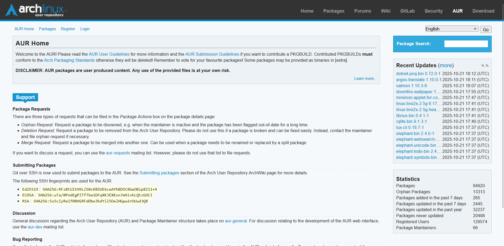

# Exercise 05: Markdown Practice

## Hook
The hook of the page is the slightly highlighted welcome box, which briefly introduces the website and its functions. It has a **bolded** heading and disclaimer within it. Afterwards, the eye moves down the page, using an **F-pattern** to guide the eye.

## Main Section
The page has a scrollable main section, containing several sections dedicated to functions of the website, such as:
- Package requests
- Submitting packages
- Discussion
- Bug Reporting

## Sidebar
There is also a sidebar that has quick access to recent updates and quick statistics. There is also a navigation bar at the top, as well as a few [links](https://aur.archlinux.org/) immediately where the eyes are drawn which provide easy access to the most commonly used pages on the website.

## Color
The color is black on white, with accents of blue and gray. All of these are **high contrast** and make it easy to read and find important elements on the page. It allows the eye to move more quickly across the page, making it easy to find what you're looking for.

## Conclusion
The design is simple yet highly effective and detailed, which makes sense for a site dedicated to linux, which is notoriously barebones yet highly customizable.